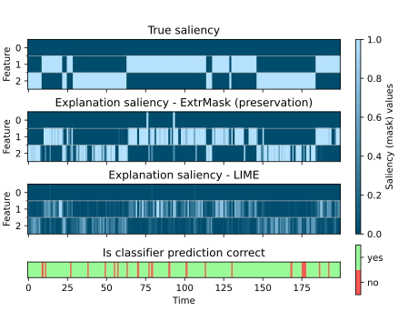

# On the reproducibility of: "Learning Perturbation to Explain Time Series Predictions"
## Anonymous authors

<p align="center">
  
</p>

 We used the provided code of [Joseph Enguehard](https://github.com/josephenguehard/time_interpret) to run all experiments. 
 
 Some additions/changes we made:
- Adding a [notebook that shows the main results we obtained](results/main.ipynb) and [a notebook that visualizes the learned masks and perturbations](results/saliency_perturbation_debug_plots.ipynb).
- Fixing an issue in the implementation of the deletion game.
- Adjusting the loss function for the deletion game.
- Providing code for experiments on a weather dataset.
- Fix HMM data caching issue, causing incorrect results in the paper.
- Providing additional options to run the revised deletion game easily.
- Adding code that saves files used for certain tables/figures.

## Getting started

### Installing the dependencies
Clone the repository:
```
git pull https://github.com/yosuah/time_interpret_private.git
```
Go inside the root directory:
```
cd time_interpret_private
```
Create the conda environment
```
conda env create -f environment.yml
```

### Running one fold
Activate the conda environment:
```
conda activate tint
```

You may need to specify a PYTHONPATH, on Linux:
```
export PYTHONPATH=/home/<username>/tint/time_interpret_private:$PYTHONPATH
```

To run the hmm experiment:
```
python experiments/hmm/main.py
```

To run the MIMIC-III experiment (Note that you need credentialized access to this datatset):
```
python experiments/mimic3/mortality/main.py
```

To run the weather data experiment:
```
python experiments/weather/main.py
```

If you don't want to run all explanation methods you can add a flag such as:
```
--explainers extremal_mask_preservation extremal_mask_deletion dyna_mask deep_lift
```

## Acknowledgment
- [Joseph Enguehard](https://github.com/josephenguehard/time_interpret) for almost all the code.
